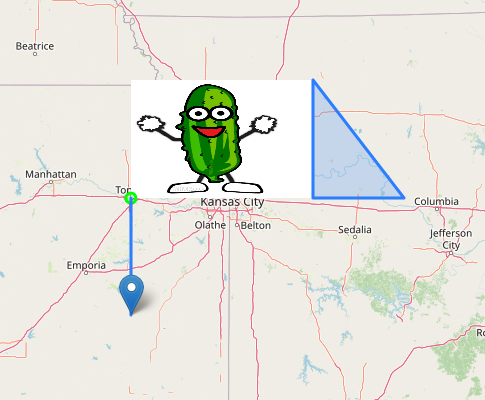

# Rescript Leaflet React &middot; [](https://github.com/facebook/react/blob/main/LICENSE) &middot; [](https://www.npmjs.com/package/rescript-leaflet-react)
Rescript bindings for [React Leaflet JS](https://react-leaflet.js.org/)

## Getting Started

1. Install the package
```
npm i rescript-leaflet-react
```
1. Add this to you `bsconfig.json`:
```json
"bs-dependencies": [
    "@rescript/react",
    "rescript-leaflet-react"
]
```
1. Import into your Rescript project
```rescript
open RescriptLeafletReact
```

5. Access the `LeafletReact` module

## Example Usage

```rescript
open RescriptLeafletReact

let s = React.string

module EventLogger = {
  @react.component
  let make = () => {
    open LeafletHooks

    let map = useMap()
    let mapEvents = useMapEvents(EventHandlers.make(
      ~click = (event) => {
        Js.log("Mouse Click:")
        Js.log(event)
      },
      ()
    ))

    let onSingleEvent = useMapEvent("drag", (pos) => {
      Js.log("Drag Event:")
      Js.log(pos)
    })

    Js.log("Center:")
    Js.log(map.getCenter(.))
    <></>
  }
}

@react.component
let make = () => {
  open LeafletReact

  let logMouseEvent = (t) => {
    Js.log(t)
  }

  let logPopupEvent = (t) => {
    Js.log(t)
  }

  let logDragEvent = (t) => {
    Js.log(t)
  }

  let bounds = create_bounds(
    (39.043705, -95.692240), (40.043705, -93.692240)
  )

  let pathOptions = PathOptions.make(
    ~color="#00ff00",
    ()
  )

  <div>
    <MapContainer
      center={(39.043705, -95.692240)}
      style={ReactDOM.Style.make(
        ~height = "100vh",
        ()
      )}
      zoom={3.}
    >
      <TileLayer
        attribution={"&copy; <a href=\"https://www.openstreetmap.org/copyright\">OpenStreetMap</a> contributors"}
        url={"https://{s}.tile.openstreetmap.org/{z}/{x}/{y}.png"}
      />
      <EventLogger />

      <Marker
        position={(38.043705, -95.692240)}
        eventHandlers={EventHandlers.make(
          ~click = logMouseEvent,
          ~popupopen = logPopupEvent,
          ~drag = logDragEvent,
          ()
        )}
      >
        <Popup>
          {s("You clicked on the marker")}
        </Popup>
      </Marker>

      <Circle
        center={(39.043705, -95.692240)}
        radius={5000.}
        pathOptions={pathOptions}
      />

      <Polyline
        positions={[
          (39.043705, -95.692240),
          (38.043705, -95.692240)
        ]}
      />

      <Polygon
        positions={[
          (40.043705, -93.692240),
          (39.043705, -93.692240),
          (39.043705, -92.692240),
          (40.043705, -93.692240),
        ]}
      />

      <ImageOverlay
        url={"http://3.bp.blogspot.com/-rtiLKRi9zNY/UpdeBJ72Z9I/AAAAAAAAFFQ/qkG2I6fWpv0/s1600/dancing-pickle-like-dancing-banana-large-color-animated.gif"}
        bounds={bounds}
      />
    </MapContainer>
  </div>
}
```
This snippet of code generates this map:



## Limitations:
This is not a complete binding, if anyone wants to chip away at the library
I would happily merge it in.

Because of some weirdness with `this` binding and rescript's currying system, all the hook functions (getCenter, zoomIn, etc.) must be called in the uncurried way
(using `func(. param)` notation)

## Support
Here is a basic list of what is supported right now:

### Components
- MapContainer
- TileLayer
- Market
- Popup
- Tooltip
- Circle
- Polyline
- Polygon
- Rectangle
- Pane
- ImageOverlay
- VideoOverlay

### Hooks
- useMap
- useMapEvents
- useMapEvent
